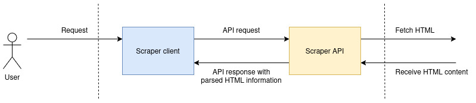
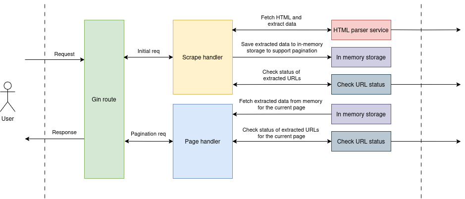
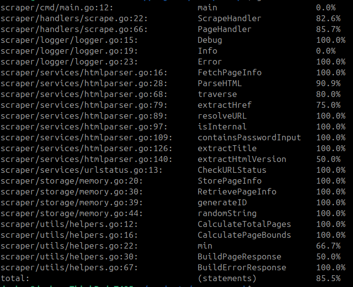
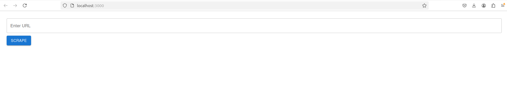
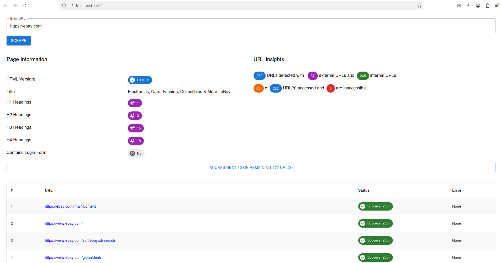

# Scraper

## Table of content

1. [Introduction](#introduction)
2. [Software components](#software-components)
3. [Design challenge](#design-challenge)
4. [Technical stack](#technical-stack)
5. [How to run unit tests](#how-to-run-unit-tests)
6. [Pre-requisites to build and run](#pre-requisites-to-build-and-run)
7. [How to build and run](#how-to-build-and-run)
8. [CI/CD usage](#cicd-usage)
9. [Logging](#logging)
10. [For next steps](#for-next-steps)

## Introduction

This is a scraper which can use to submit a valid URL and scrape following information from the website content.

* HTML version
* Page title
* Number of headings and levels
* Internal links
* External links
* Number of inaccessible links on the page
* If the page contains a login form

## Software components

The scrape application consists of two main software components as Scraper API and Scraper client. 


<p align=center>[Figure 01 - Scraper high level design]</p>

1. [Scraper API](https://github.com/go-scraper/scraper-api) - This is the backend API service for the scraper client web application. This executes the scraping and responds back to the client web application with the information found.
2. [Scraper client](https://github.com/go-scraper/scraper-client) - This is the client facing web application which can access through the browser. This connects with the Scraper API to execute scraping.


The *scrape API* modularized as follows,

1. Handlers
    * Scrape handler - Handles the initial scrape request.
    * Page handler - Handles subsequent pagination requests.
2. Services
    * HTML parser - Fetch the HTML content of the given URL and process.
    * URL status checker - Checks statuses of URLs found on HTML content.
3. Models
    * Entity - Models for the data transfer and storage within the application.
    * Response - Models to construct API response payloads.
4. Storage
    * In-memory storage - Holds fetched information mapped to a random unique key.
5. Utils
    * Helpers - Helper functions.


<p align=center>[Figure 02 - Scraper API high level architecture diagram]</p>

## Design challenge

> Requirement

After fetching the HTML content we should find all external and internal links from the HTML content and find the number of inaccessible links, if there are any.

> Challenge

An HTML page can have numerous amount of hyperlinks and each hyperlink is pointed to a host with some latency. This latency can differ from 100 milliseconds to 10 seconds or more due to many facts. 

If user enters a website with hundreds of links, and if our service is trying to check the accessibility of each link before respond back to the initial query, then user might need to wait for a minute or two or even more to see the response. Also, if user submits a website URL with thousands of hyperlinks on the same page, then our system will struggle to process all and user may leave due to the long waiting time. But due to our concurrent nature of implementation and statelessness of the API, the system will still access all hyperlinks, even after user closed the browser.

Therefore, this can cause for a bottleneck in the system and can cause for a system failure easily.

> Solution

We designed the scraper-api to process only 10 hyperlinks concurrently at a time. After receiving the initial scraping request the scraper-API fetch the HTML content and collect all required information and store in the in-memory storage. And then, process first 10 hyperlinks and mark the accessibility status and reply back with the response. To process the rest of the hyperlinks, we provided a button to access next 10 hyperlinks subsequently and we accumilate inaccessible hyperlink count and show on the UI.

With this approach, the initial response of scraping a website with around 500 hyperlinks took only between 2-3 seconds and each subsequent hyperlink process request took only 1-2 seconds.

With this approach the application can support websites with considerably high amount of URLs.

#### Limitations

* In-memory storage - Since we use in-memory storage to store extracted information, this can make a negative impact when receiving many requests from users to fetch huge websites. Also, can cause for data loss.

## Technical stack

### Scraper API

1. Go language
2. Gin framework
3. Monkey mock
4. Httpmock
5. Testify
6. Cors
7. Docker
8. Docker compose
9. Github actions
10. Go vet

### Scraper client

1. ReactJs
2. TypeScript
3. Material UI
4. Docker
5. Docker
6. Docker compose
7. Github actions

## How to run unit tests

### 1. Scraper API

#### Pre-requisites

* Go lang

#### Steps

1. Clone the github repo using, `git@github.com:go-scraper/scraper-api.git` command.
2. Open the command line and navigate to the `scraper-api` dir.
3. Run `go mod tidy` command to install all dependencies listed in `go.mod` file.
4. To run unit tests with the coverage output run `go test -coverprofile=coverage.out ./...` command.
5. To view the test coverage run `go tool cover -func=coverage.out` command.


<p align=center>[Figure 03 - Test coverage output]</p>

## Pre-requisites to build and run

* Docker - Since both software components are Dockerized, having docker service up and running on your machine would be enough to build and run the scraper.

## How to build and run

To use the scraper, we have to run both scraper client and the API.

### 1. Scraper API - [GitHub repo](https://github.com/go-scraper/scraper-api)

1. Clone the github repo using, `git@github.com:go-scraper/scraper-api.git` command if you haven't already.
2. Open the command line and navigate to the root folder `(scraper-api)` of the project.
3. To build and run with the docker run `docker-compose up --build` command.
4. Try sending a `GET` request using Postman or any client to the URL `http://localhost:8080/scrape?url=https://google.com`. You can have any valid URL to the `url` query parameter.
5. If the application is up and running without any errors, you should receive a response in below format with the HTTP code `200`.

```json
{
    "request_id": "20250104020245-hYVHLDhl",
    "pagination": {
        "page_size": 10,
        "current_page": 1,
        "total_pages": 2,
        "next_page": "/scrape/20250104020245-hYVHLDhl/2"
    },
    "scraped": {
        "html_version": "HTML 5",
        "title": "Google",
        "headings": {},
        "contains_login_form": false,
        "total_urls": 19,
        "internal_urls": 15,
        "external_urls": 4,
        "paginated": {
            "inaccessible_urls": 0,
            "urls": [
                {
                    "url": "https://www.google.com/imghp?hl=en&tab=wi",
                    "http_status": 200,
                    "error": ""
                },
            ]
        }
    }
}
```

6. Next we should build and run the Scraper client application.

### 2. Scraper client - [GitHub repo](https://github.com/go-scraper/scraper-client)

1. Clone the github repo using, `git clone git@github.com:go-scraper/scraper-client.git` command if you haven't already.
2. Open the command line and navigate to the root folder `(scraper-client)` of the project.
3. To build and run with the docker run `docker-compose up --build` command.
4. Access the web application on your browser using the `http://localhost:3000/` URL.


<p align=center>[Figure 04 - Client application screen]</p>

5. Now you can enter a URL on the input box and click on `SCRAPE` button or hit `Enter`. You should see the scraping result as below screenshot.


<p align=center>[Figure 05 - Client application screen with scraping results]</p>

6. When there are more than 10 hyperlinks detected, accessibility of those will be checked page basis. Therefore, click on the `ACCESS NEXT 10 OF REMAINING...` button to proceed with next 10 hyperlinks. And if there are inaccessible hyperlinks detected, the value will be accumilated to the URL insights data.

## CI/CD usage

Added github workflow `YML` files to both scraper API and client repos to verify,

* Dependency download
* Unit tests
* Source build
* Docker build

## Logging

Defined custom loggers for the `scraper-api` and following log levels are available.

1. DEBUG - The printed log line will start with `[scraper-DEBUG]`
2. INFO - The printed log line will start with `[scraper-INFO]`
3. ERROR - The printed log line will start with `[scraper-ERROR]`

## For next steps

Below improvements/extensions identified as potential next steps.

* Replace the in-memory storage with a database.
* Use a messaging technique to pass data changes in real-time to the UI.
* Provide a personalized dashboard to see/manage the scraping history.
* Allow users to create scheduled scraping jobs.
* Allow users to setup custom data processors and configure alerts.
* Introduce a pricing model based on supported features/provided resource limits.